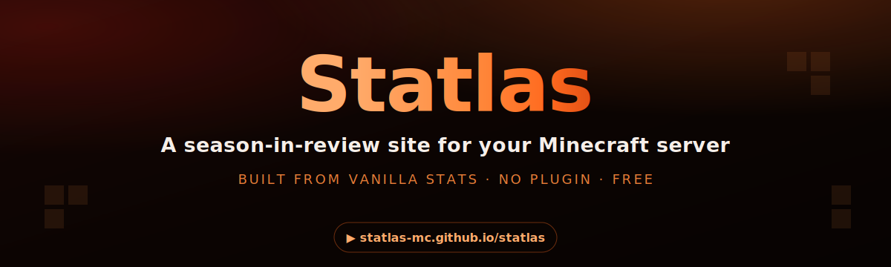

<p align="center">
  
</p>

<p align="center">
  <b><a href="https://statlas-mc.github.io/statlas/">Open the generator</a></b> &nbsp;·&nbsp;
  <b><a href="https://statlas-mc.github.io/max-smp/">See a live example</a></b>
</p>

<p align="center">
  
  
  
  
</p>

---

Turn any Minecraft server's vanilla world stats into a **shareable season recap** —
a personal, animated stats site for every player, plus server-wide superlatives and
leaderboards. **No plugin, no signup, no data upload** — everything is parsed in your
browser, and you export one file you can host anywhere for free.

> **Try it in 10 seconds:** open the [generator](https://statlas-mc.github.io/statlas/)
> and click **“Try with sample data”** — no world folder needed.

Two ways to use it:

1. **No-install web app** — drag your world folder into the browser, customize (theme,
   sections, awards, branding), preview live, and download a ready-to-host site. Your
   world data never leaves your computer; everything is parsed in the browser.
2. **Command-line kit** — for admins who’d rather run a script: point a config file at
   your world folder and generate the same site.

Both produce a **single self-contained `index.html`** you can host free on Netlify,
GitHub Pages, Vercel, or your own domain.

---

## What it shows

- **Homepage** — server totals, a Hall of Fame of superlatives, interactive leaderboards,
  and a card grid of every player (with their current skin head).
- **Per-player recap** — an animated scroll-through: playtime reframed as days, the death
  reel + your nemesis, grind identity, *your palette* (the blocks your base is made of),
  combat log, movement fingerprint (with a real-world distance comparison), consumption &
  chaos, and your season titles.

Player skins render live from `mc-heads.net`; block textures from the vanilla-asset CDN.

---

## Option 1 — Web app (easiest, no install)

Run it locally, or use the hosted version:

```bash
npm install
npm run dev        # opens Statlas at http://localhost:5174
```

Then: **drop your world folder → customize in the sidebar → “Download my site”.**
You need the `stats` folder; usernames come from your `usercache.json` if present, and are
otherwise looked up online automatically. `advancements` is optional. The built-in
**deploy guide** walks you through hosting and custom domains.

## Option 2 — Command-line kit

```bash
npm install
npm run build:viewer                       # build the renderer template once
cp kit/config.example.json kit/config.json # then edit it (worldPath, server name, theme…)
node kit/generate.mjs kit/config.json      # → dist-site/index.html
```

`kit/config.json` options:

| Key | What it does |
|-----|--------------|
| `worldPath` | Path to your world folder (the one containing `stats/`). |
| `usercachePath` | Optional explicit path to `usercache.json` (otherwise it looks next to the world). |
| `resolveNames` | `true` to look up any missing usernames from Mojang. |
| `server`, `season`, `logo` | Branding. `logo` is a path to an image file. |
| `theme` | `ember`, `ocean`, `amethyst`, `forest`, `rose`, `amber`, or `slate`. |
| `customAccent` | A hex like `"#ff6a1f"` to override the accent. |
| `sections` | Toggle recap segments on/off. |
| `awards.disable` | List of default award keys to hide. |
| `awards.custom` | Your own awards — `{ key, title, desc, icon, metric, unit }`. |

Available award `metric`s: `playHours, totalKm, deaths, mobKills, playerKills, totalMined,
totalPlaced, diamonds, deepslateMined, totalFood, tnt, traded, jumps, chestsOpened, slept,
bred, enchants, fishCaught, advancements, damageDealt, toolsBroken`.

---

## Deploy your generated site

You get one `index.html`. Host it free anywhere:

- **Netlify Drop** (fastest): drag the file onto <https://app.netlify.com/drop> → instant public URL.
- **GitHub Pages**: upload the file to a public repo, enable Pages in Settings.
- **Vercel**: drop the folder at <https://vercel.com/new>.
- **Custom domain**: any of the above lets you attach `recap.yourserver.net` for free via a CNAME record.

Because skins and textures load from the internet at view time, keep it *hosted* rather
than emailing the file around.

---

## Deploy Statlas itself

```bash
npm run build      # static app in dist/
```

Drop `dist/` on any static host. (This repo also ships a GitHub Actions workflow that
auto-deploys Statlas to GitHub Pages on push.)

## How it works

- `src/engine/` — framework-agnostic stats engine (runs in the browser *and* Node), built
  from vanilla `stats/*.json`.
- `src/renderer/` — the themeable, config-driven recap renderer (CSS-variable theming).
- `src/studio/` — the generator UI (upload → customize → preview → export + deploy guide).
- `viewer.html` builds to a single self-contained template that the app/kit inject data into.
